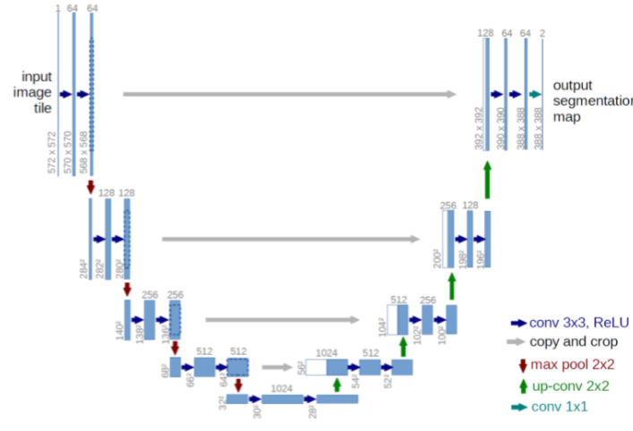
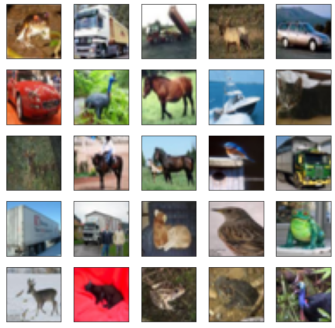
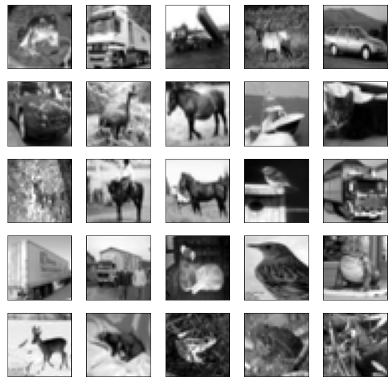
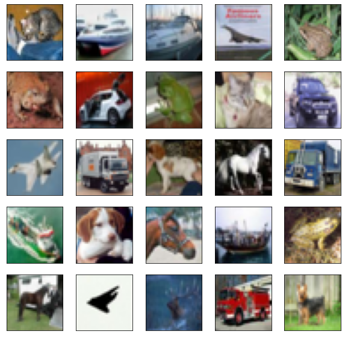
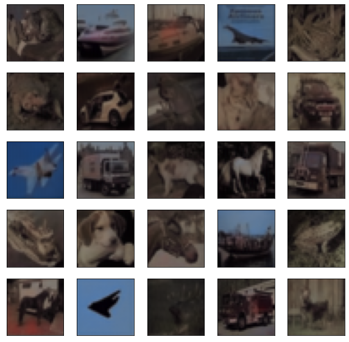

# SCC5830-ImageProcessing2021
Final project of the discipline  SCC5830 - Image Processing (2021) in USP São Carlos.
Student: Taylla Milena Theodoro

# Summary 

**Main Objective** To perform image colorization (grayscale to colored) using unet.

**Dataset** Cifar10 dataset - https://www.tensorflow.org/api_docs/python/tf/keras/datasets/cifar10

**Steps**
- Learn about the dataset;
- Prepare the dataset: Preprocess the images from the dataset in order to perform correctly the task;
- Define the model: Chose and study architectures that can better perform the taks;
- Train the model: Feed the training images into the chosen model;
- Evaluate: Chose an evaluation capable of tell how the chosen model perfomed the task, in our case, evalute the model performace and plot the input (grayscale images), predicted and expected(original image colorful).

# Main Objective
To perform image colorization (grayscale to RGB) using unet and learn the tools and path towards compleating this objective.

# Introduction

## Unet

The main idea behind CNN is to learn the feature mapping of an image and explore it to do tasks like object classification or detection, where the image is converted into a vector. However, in the case of the image colorization problem, you not only need to convert the mapping feature into a vector, but also reconstruct an image from that vector.
The idea behind U-net is to use the feature mapping that has already been learned and converted into a vector to reconstitute the image. 

This architecture consists of three sections: The contraction, The bottleneck, and the expansion section, as can be seen in the Figure, the contraction is perfoming a downsamplimg of the image, as a normal Convolutional Neural Network, the bottleneck is the middle that prepare the resulted vector to be upsamples by the expansion section.

## Image Colorization
According to the article [Image Colorization: A Survey and Dataset](https://arxiv.org/pdf/2008.10774.pdf), image colorization is an essential image processing and computer vision branch to colorize images and videos. It can be applied to color old movies, old photos, old video games, astronomical photography, electron microscopy, etc. 
Recently, the technic used to perform this task is with deep learning procedures, such as Convolutional Neural Networks, Residual Neural Networks, Unet, Autoencoders and Generative Adversial Netwolks.

## Project Proposal Overview

To colorize images is an important computer vision task, which allows us to bring to life old images, therefore, in this project, it is intend to perform image colorization using Unets. The input images that will be used are Cifar10 dataset, available in https://www.tensorflow.org/api_docs/python/tf/keras/datasets/cifar10. As output it is expected to have the colored image.

# Methodology

The methodoly chosed with the purpose of learning and completing this project is the by following the steps:

- **Related Work:** learn about datasets, the task, possible architectures and evaluation methods;
- **Prepare the dataset:** Preprocess the images from the dataset in order to perform correctly the task;
- **Define the model:** Chose and study architectures that can better perform the taks;
- **Train the model:** Feed the training images into the chosen model;
- **Evaluate:** Chose an evaluation capable of tell how the chosen model perfomed the task, in our case, evalute the model performace and plot the input (grayscale images), predicted and expected(original image colorful).

## Dataset

The chosen Dataset is [Cifar10](https://www.tensorflow.org/api_docs/python/tf/keras/datasets/cifar10), which contain images from diverse scenarios and locations which enable the network to learn to colorize different kinds of images. It will be use its original split for train and test, which  is  of 50000 32x32 color training images and 10000 test images.
Here are some examples of images:

### Preprocessing

The dataset contain RGB images, which will be preprocessed by using color analysis. The images will be converted to gray scale images to be used as the input images of the neural network using the skimage python library, and the original colored image will be used as the label so that the output can converted back to RGB and evaluated.

# Model

The model is trained with the unet model, the loss is 'the mean_squared_error', the optimizer chosen is  'adam' and as metric 'accuracy'. 

The model was trained for 20 epochs and presented an accuracy 58.34% (0.5834) for training and 54.18% (0.5418) for testing.

## Evaluation

In terms of visualizing the predicted results, here is a set of images from test.

And here the prediction for this set of images:

# Conclusion

The results were good for start, it is possible to make it better by perfoming fine tuning or different kinds of image processing. This project is a good start for someone persuing to study automatic image colorization and give base for a more complex project, such as ones using autoencoders or GANs.

